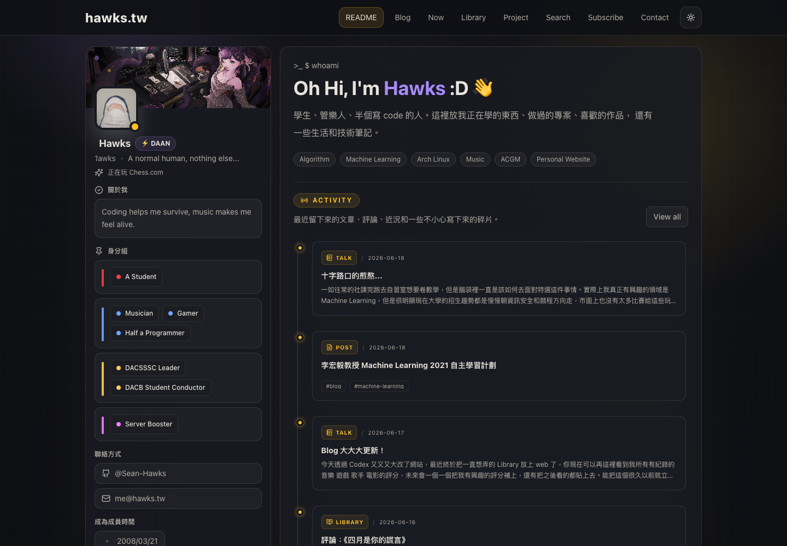
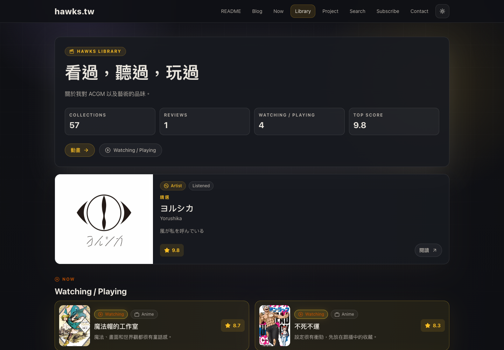
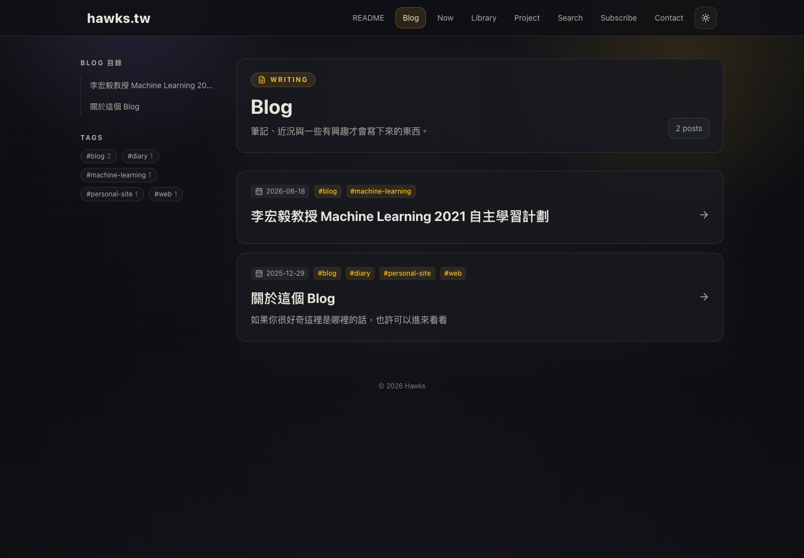

# Markdown Personal Library Site Template

A Next.js personal site template for people who want a Markdown-maintained Library of things they love, plus writing, activity logs, projects, search, and RSS.

It is designed to feel like a personal profile instead of a resume: a sidebar identity card, a README-style home page, recent activity, Markdown blog posts, short notes, full-site search, RSS, and a Library for anime, movies, artists, games, books, or anything else you want to collect.

The core idea is simple: edit Markdown files, commit them, and your public Library updates automatically.

## Live Demo

See the finished template at [sean-hawks.github.io/personal-library-site-template](https://sean-hawks.github.io/personal-library-site-template/).

Original site and inspiration: [hawks.tw](https://hawks.tw/).

## Production Preview

Desktop screenshots from the original site, [hawks.tw](https://hawks.tw/).

| Home | Library |
| --- | --- |
|  |  |

| Blog |
| --- |
|  |

## Features

- Library-first homepage with profile, activity timeline, featured picks, latest posts, talks, and projects
- Markdown Blog, Talk, and Library content powered by YAML frontmatter
- Library categories for `anime`, `movie`, `artist`, and `game`
- Review pages with cover images, ratings, tags, recommended works, and featured ordering
- Tag archive pages shared by Blog and Library content
- Full-site search
- RSS feed at `/rss.xml`
- Light and dark theme toggle
- Static export ready for GitHub Pages

## Quick Start

```bash
npm install
npm run dev
```

Open [http://localhost:3000](http://localhost:3000).

Before publishing:

```bash
npm run lint
npm run build
```

## Make It Yours

Search for these placeholders and replace them:

- `Your Name`
- `your-site.example`
- `your-github`
- `hello@example.com`

Then edit:

- `app/components/ProfileSidebar.tsx` for avatar text, bio, contact, and profile details
- `app/components/ReadmeSection.tsx` for the homepage intro
- `app/data/roles.ts` for profile tags
- `app/data/projects.ts` for project cards
- `public/avatar.svg` and `public/banner.svg` for your own visuals

Most day-to-day updates happen in Markdown:

- `content/library/*.md` for Library items and reviews
- `content/posts/*.md` for longer posts
- `content/talks/*.md` for activity notes

## Content

Blog posts live in `content/posts/`.

```yaml
---
title: "My first post"
date: "2026-01-01"
desc: "One sentence summary."
tags:
  - "#blog"
status: published
---
```

Short updates live in `content/talks/`.

```yaml
---
title: "Today I changed the site"
date: "2026-01-02"
subtitle: "A short activity note."
event: "Personal Website"
tags:
  - "#log"
status: published
---
```

Library entries live in `content/library/`.

```yaml
---
title: "Work title"
subtitle: "Optional subtitle"
category: "anime"
year: "2026"
date: "2026-01-03"
status: "watched"
recommendation: "recommended"
rating: 8.5
featured: true
featuredOrder: 1
tags:
  - "#favorite"
note: "Short personal note."
image:
  src: "/images/library/example-anime.svg"
  alt: "Cover image"
  credit: ""
  source: ""
  fit: "cover"
---
```

If a Library Markdown file has body content, it becomes a clickable review page. If it only has frontmatter, it works as a collection card. This makes the site easy to maintain from a Markdown editor, Obsidian vault, or ordinary Git workflow.

## Library Fields

- `category`: `anime`, `movie`, `artist`, or `game`
- `status`: `watched`, `listened`, `watching`, `playing`, `played`, `planned`, or `recommended`
- `recommendation`: `brilliant`, `favorite`, `recommended`, or `casual`
- `rating`: number from `0` to `10`, or `null`
- `featured`: promotes the item into homepage and Library highlights
- `featuredOrder`: lower numbers appear first
- `recommendedWorks`: optional list for artist or creator pages

## Deployment

This template is configured for static export and GitHub Pages.

1. Create a GitHub repository from this template.
2. Push to `main`.
3. In GitHub, open `Settings -> Pages`.
4. Set the source to GitHub Actions.
5. Optional: add your custom domain and create `public/CNAME`.

If you deploy under `https://<user>.github.io/<repo>/`, the GitHub Actions workflow automatically reads the repository name and builds with the correct subpath.

If you deploy with a custom domain, set a repository variable:

```text
DEPLOY_TARGET=custom-domain
```

## Recommended First Issues

- Add a `siteConfig` file to centralize all profile and metadata settings
- Add more Library categories
- Add a theme preset system
- Add a CLI script that creates new content from templates
- Improve Open Graph image generation for Library reviews

## License

MIT
